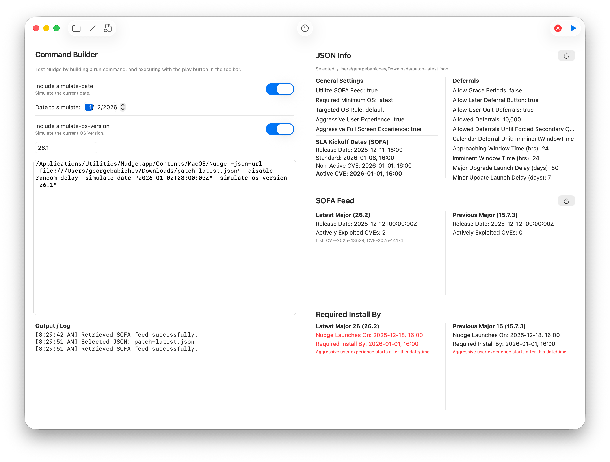
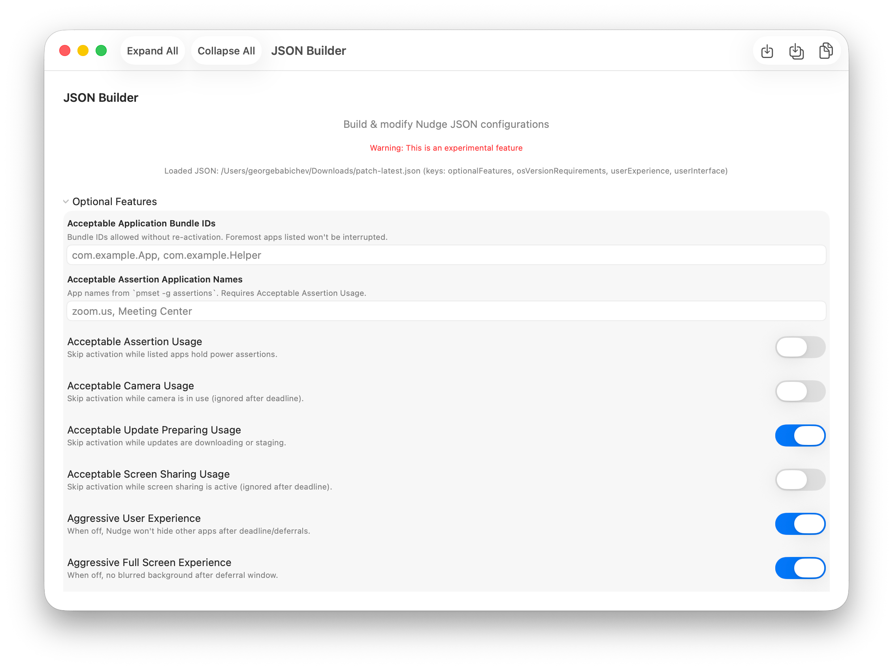

# Nudgr

<div align="center">

<picture>
  <source srcset="Documentation/icon-dark.png" media="(prefers-color-scheme: dark)">
  <source srcset="Documentation/icon-light.png" media="(prefers-color-scheme: light)">
  
</picture>
<br/><br/>

<p>Nudgr is a small macOS utility for inspecting Nudge configuration files and the SOFA feed, with tools to simulate and control Nudge behavior during testing.</p>

</div>

<p align="center">
    <a href="Documentation/App1.png"></a>
    <a href="Documentation/App2.png"></a>
</p>

## What it does

- Loads a Nudge JSON file and shows basic parsing info and required OS targets.
- Fetches the SOFA feed and highlights:
  - when an update must be installed
  - when Nudge will open
- Supports simulation of date and OS version to test different scenarios.
- Launches the Nudge command and can kill the Nudge process.
- Includes utilities to install or uninstall Nudge by pulling the latest release from GitHub.
- Provides quick shortcuts to generate commands for logging Nudge actions.
- Provides a JSON Builder.

## Typical workflow

1. Select a Nudge JSON file.
2. Review parsed config details and SOFA summaries.
3. Adjust simulated date/OS version if needed.
4. Run or kill Nudge from the toolbar controls.

## What it's not

- Nudgr is **not** a JSON / MDM payload validator. It's simply a viewer, that lets you easily test & simulate different scenarios without having to remember all the command line shortcuts. 

## 🖥️ Install & Minimum Requirements

- macOS 15.0 or later  
- Apple Silicon & Intel (not tested on Intel)
- ~10 MB free disk space  

### ⚙️ Installation

Download from Releases. It's signed & notarized.

### ⚙️ Build it yourself!

Clone the repo and build with Xcode:

```bash
git clone https://github.com/gbabichev/Nudgr.git
```

## 📝 Changelog

### 1.0.0
- Initial release

## 📄 License

MIT — free for personal and commercial use. 